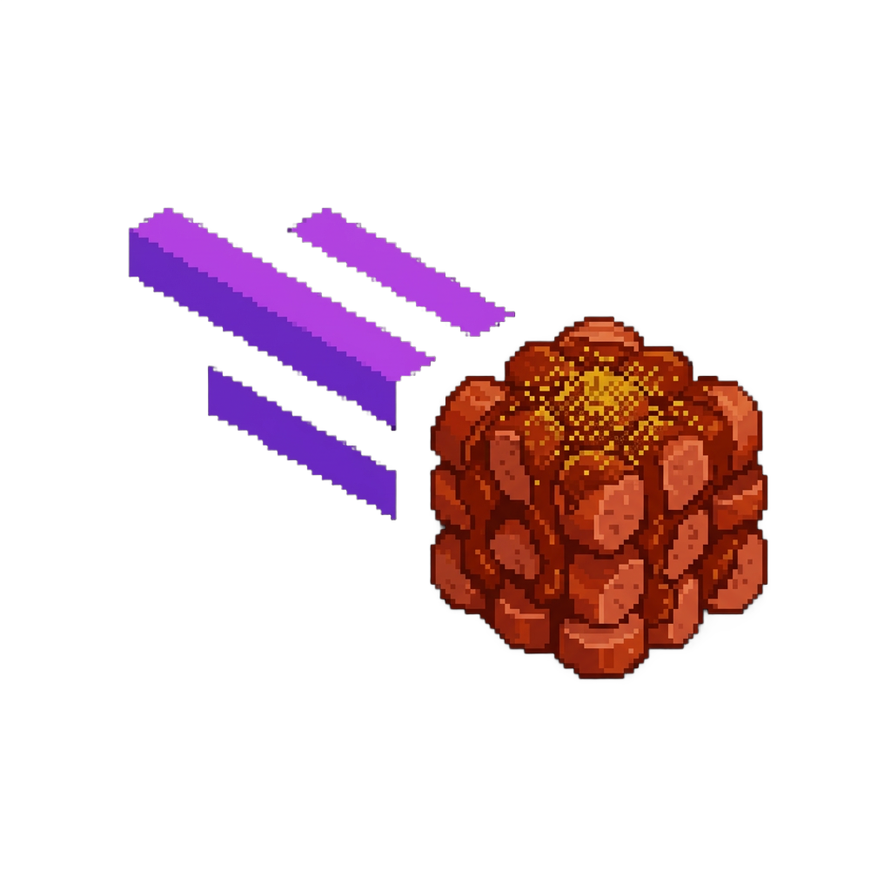

<div align="center">
 <h1> <br/>Wurstmeteor Addon</h1>

  
 <br>
  

</div>
<br/>

A [Meteor Client](https://github.com/MeteorDevelopment/meteor-client) addon that ports selected [Wurst Client](https://github.com/Wurst-Imperium/Wurst7) features to Meteor.

## Supported versions:
- **Minecraft 1.21.5 (`legacy/1.21.5`)**

## Included Modules

- `AntiSpam`
- `ArrowDMG`
- `AutoFarm`
- `AutoLibrarian`
- `AutoMine`
- `BarrierESP`
- `PotionSaver`
- `CreativeFlight`
- `InvWalk`
- `Trajectories`
- `HealthTags`
- `FeedAura`
- `MaceDMG`
- `NewChunks`
- `MultiAura`
- `BonemealAura`
- `Criticals`
- `ItemESP`
- `TreeBot`

## Stack

- Minecraft: `1.21.5`
- Yarn: `1.21.5+build.1`
- Fabric Loader: `0.16.12`
- Fabric API: `0.128.2+1.21.5`
- Meteor Client: `1.21.5-SNAPSHOT`
- Java: `21`

## Build

```bash
./gradlew build
```

Output jar:

- `build/libs/wurst-meteor-addon-<version>.jar`

## Dev Notes

- Addon category: `Wurst`
- Package root: `de.njlent.wurstmeteor`
- Module source split:
  - `modules/combat`
  - `modules/world`
  - `modules/render`

The implementation is structured for easy extension: each module is isolated and uses Meteor-native events/utilities.

<br>
<br>
<br>

> [!IMPORTANT]
> Check out my other Meteor addons:
>
> <table>
>   <tr>
>     <td valign="middle">
>       
>     </td>
>     <td valign="middle">
>       <a href="https://github.com/njlent/Minehop-Meteor-client-addon">Minehop Addon - Source Engine-style bunnyhopping</a>
>     </td>
>   </tr>
> </table>
